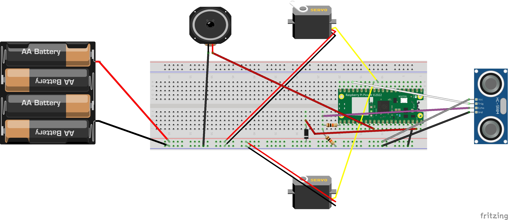

# pnmb4

PNMB4 is a robot in development.

# Version 0

This is the completely controlled version with little to no intelligence of its own. It can (remotely controlled) drive and measure distance using an US sensor.

The components of PNMB4.0 are fixed on foamcore, which is light and sturdy enough to drive around. No effort was made to make it look good yet :grin:.

## Schematics

Here is the wiring for PNMB4.0. The resistors are 10k and the diode is a 1N4732.

